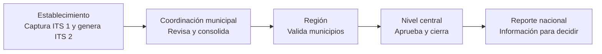
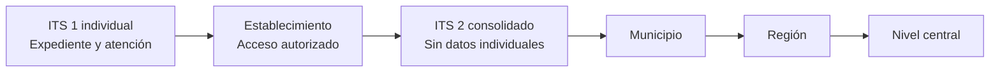
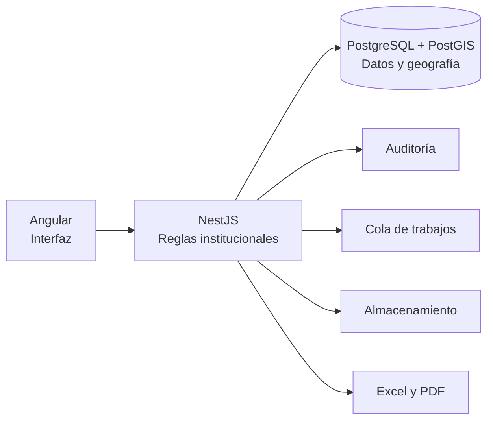
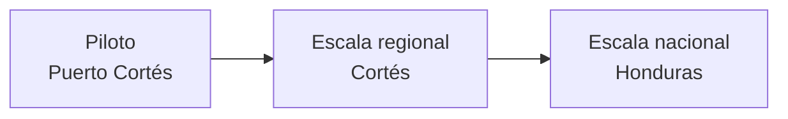

# Pitch para autoridades — Proyecto de automatización del programa ITS

## Mensaje central

El proyecto no busca únicamente reemplazar formularios en papel o archivos de Excel. Busca crear una cadena institucional confiable para que el dato se capture una sola vez, se valide en cada nivel, se consolide automáticamente y llegue a las autoridades como información oportuna para decidir, sin exponer datos individuales.

## Pitch breve

Actualmente, la información del programa ITS nace en los establecimientos de salud, pero su consolidación y revisión atraviesan múltiples pasos manuales. Esto consume tiempo, dificulta rastrear correcciones y limita la capacidad de analizar tendencias y procedencias con oportunidad.

La propuesta es implementar una plataforma que conecte todo el flujo institucional: establecimiento, coordinación municipal, región y nivel central. El establecimiento captura el Formulario ITS 1 y genera su ITS 2; municipio, región y nivel central revisan, devuelven o aprueban según su competencia. Cada acción queda registrada y cada reporte conserva su versión.

El principio más importante es la privacidad por diseño. El dato individual permanece en el establecimiento que lo genera. Los niveles superiores reciben únicamente información consolidada. Así se protege al paciente sin perder la capacidad de gestión y vigilancia epidemiológica.

La plataforma también permitirá diferenciar dos preguntas que hoy suelen mezclarse: cuánto atendió un establecimiento y qué está ocurriendo en su área de cobertura. Los mapas de producción, procedencia y AGI ayudarán a entender la captación de pacientes y la situación real del territorio.

Se propone iniciar con un piloto en Puerto Cortés y sus 12 establecimientos. Este alcance permite validar formularios, reglas, permisos, flujo de aprobación, reportes y mapas antes de ampliar a otros municipios, a la Región de Cortés y posteriormente al nivel nacional.

La tecnología está planteada para crecer sin sobredimensionar el inicio: una interfaz web, reglas institucionales centralizadas, una base de datos robusta con capacidad geográfica, auditoría y generación de reportes oficiales.

La decisión que solicitamos es autorizar el piloto, designar las contrapartes institucionales y técnicas, y facilitar los formatos, catálogos e insumos necesarios para configurar la primera versión. Validar el proceso en un entorno controlado permitirá tomar una decisión de expansión con evidencia real.

## Guion por diapositiva

1. **Apertura.** Presentar el proyecto como una infraestructura de información para decidir, no solo como digitalización de formularios.
2. **Problema.** Explicar que el costo principal del proceso actual es la pérdida de tiempo, trazabilidad y capacidad analítica.
3. **Flujo.** Mostrar que la solución respeta la jerarquía institucional existente; no sustituye funciones, las conecta.
4. **Plataforma.** Recorrer el ciclo completo: capturar, validar, consolidar, aprobar, analizar y exportar.
5. **Privacidad.** Recalcar que los niveles municipal, regional y central no acceden al ITS 1 individual.
6. **Inteligencia territorial.** Diferenciar producción del establecimiento y cobertura real/AGI.
7. **Piloto.** Explicar que Puerto Cortés reduce el riesgo y permite aprender antes de expandir.
8. **Valor público.** Enfatizar oportunidad, calidad, lectura territorial y rendición de cuentas.
9. **Arquitectura.** Mantener el mensaje simple: tecnología conocida, portable y preparada para escalar.
10. **Cierre.** Solicitar una decisión concreta: autorización, responsables e insumos.

## Preguntas difíciles y respuestas sugeridas

### ¿La plataforma expondrá información sensible?

No. El ITS 1 individual permanece en el establecimiento. Los niveles superiores consultan reportes consolidados y agregados. Las acciones sensibles y las exportaciones quedan auditadas.

### ¿Por qué comenzar en Puerto Cortés?

Porque permite probar el flujo completo con un alcance controlado: establecimientos, coordinación municipal y articulación regional. El piloto genera evidencia antes de ampliar cobertura e inversión.

### ¿El proyecto reemplazará los formatos oficiales?

No. La plataforma automatizará su captura, validación, consolidación y exportación. Los formatos y reglas deben validarse con la institución antes de configurar la versión piloto.

### ¿Qué ocurre si un reporte tiene errores?

Cada nivel puede devolverlo con observaciones. La corrección se realiza en el nivel que corresponde y queda registrada. Después del cierre oficial, una reapertura requiere autorización, motivo y auditoría.

### ¿La solución podrá crecer a escala nacional?

Sí. El modelo territorial, los permisos y la base de datos están planteados para crecer por municipio, región y nivel central. La expansión será progresiva para no trasladar errores del piloto a una escala mayor.

## Diagramas reutilizables

### Flujo institucional

### Frontera de privacidad

### Arquitectura de la solución

### Expansión progresiva

